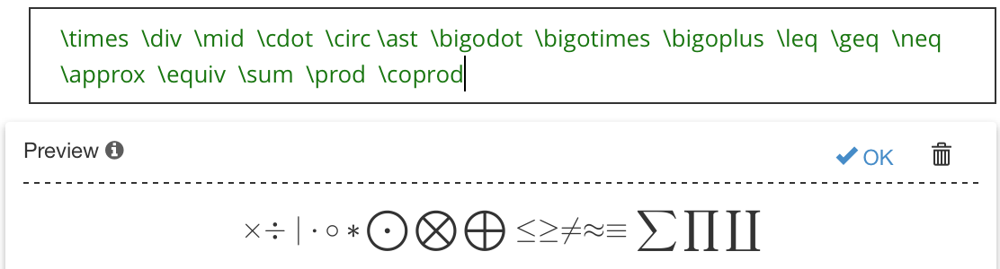
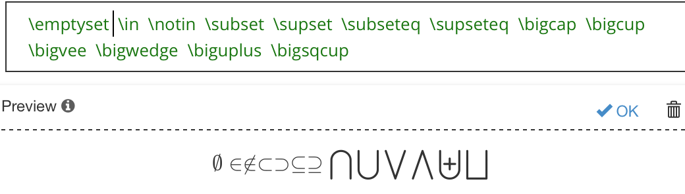
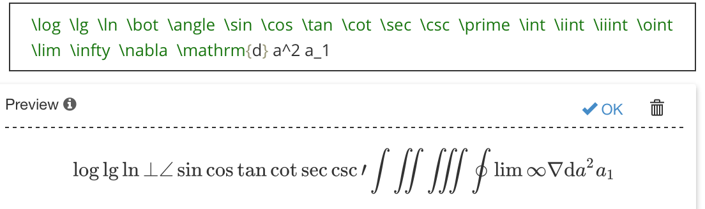
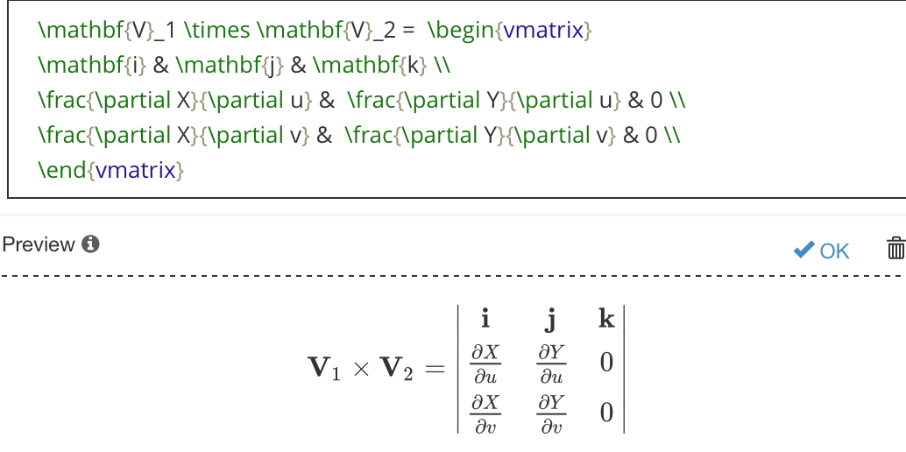

# 语法快捷键

1. command + t 可以插入表格
2. $$ + Enter 插入Latex公式   
3. 插入图片的时候直接拖拽就ok了
4. 输入[toc]+enter可以显示目录大纲
5. option + command + c 插入代码    或者 ```+enter  
6. 行内代码`代码`    \`代码\`
7. option + command + b 插入公式
8. \*斜线\*    *斜线*    或者 command + i
9. \*\*加粗\*\*    **加粗**   或者 command + b
10. **~**\~删除~\~    ~~删除~~
11. 水平分割线 ---
12. \<u>下划线\</u>    <u>下划线</u>
13. 无序列表    - 无序列表1    
14. 有序列表    1. 有序列表1
15. 任务列表    - [ ] 任务列表
16. \>引用
17. \[]()   插入网址
18. \ 插入图片


## 关系运算符

$$
\times  \div  \mid  \cdot  \circ \ast  \bigodot  \bigotimes  \bigoplus  \leq  \geq  \neq  \approx  \equiv  \sum  \prod  \coprod
$$



## 集合运算符

$$
\emptyset  \in  \notin  \subset  \supset  \subseteq  \supseteq  \bigcap  \bigcup  \bigvee  \bigwedge  \biguplus  \bigsqcup 
$$



## 数学运算符

$$
\log  \lg  \ln  \bot  \angle  \sin  \cos  \tan  \cot  \sec  \csc  \prime  \int  \iint  \iiint  \oint  \lim  \infty  \nabla  \mathrm{d} a^2 a_1
$$



## 实例

$$
\mathbf{V}_1 \times \mathbf{V}_2 =  \begin{vmatrix} 
\mathbf{i} & \mathbf{j} & \mathbf{k} \\
\frac{\partial X}{\partial u} &  \frac{\partial Y}{\partial u} & 0 \\
\frac{\partial X}{\partial v} &  \frac{\partial Y}{\partial v} & 0 \\
\end{vmatrix}
$$


$$
lim_{x \to \infty} \ exp(-x)=0
$$


